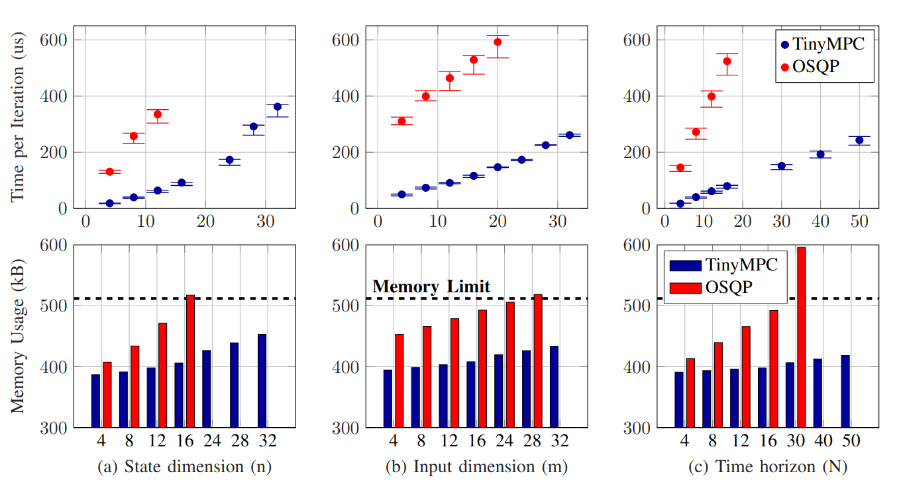
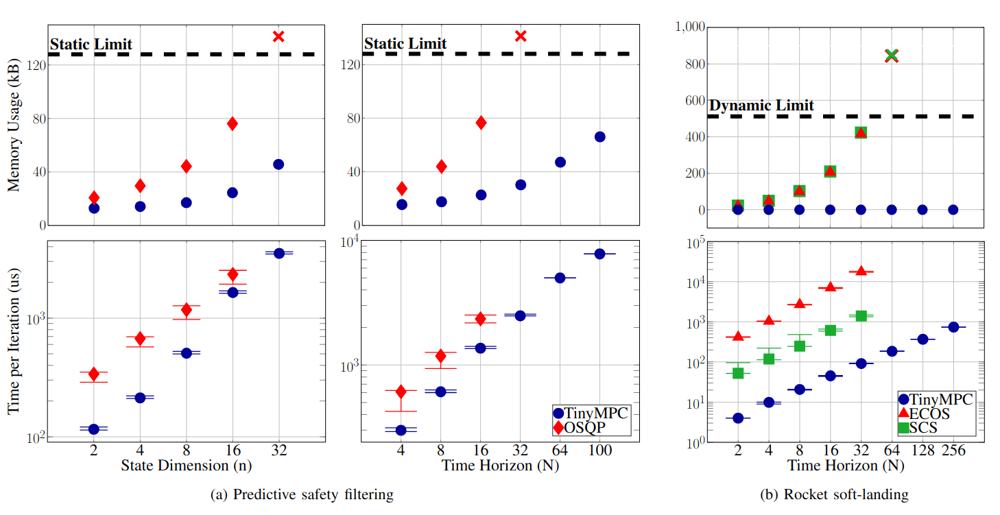
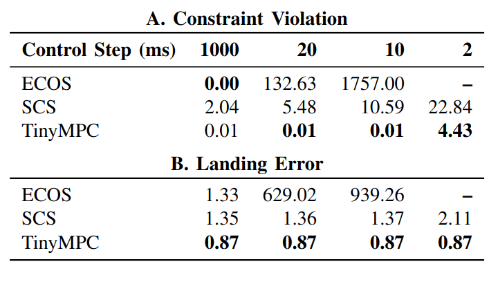

# Welcome to TinyMPC's documentation!

<p align="center">
  
  
</p>

TinyMPC is an open-source solver tailored for convex model-predictive control that delivers high speed computation with a small memory footprint. Implemented in C++ with minimal dependencies, TinyMPC is particularly suited for embedded control and robotics applications on resource-constrained platforms. TinyMPC can handle state and input bounds and second-order cone constraints. Python, Julia, and MATLAB interfaces are available to aid in generating code for embedded systems.

!!! success "" 

    🏆 TinyMPC has been nominated for Best Conference Paper Award, Best Student Paper Award, and Best Paper Award in Automation at [IEEE ICRA 2024](https://2024.ieee-icra.org/)! Thank you to everyone who has used TinyMPC and provided feedback!

[Get Started :material-arrow-right-box:](get-started/examples.md){.md-button}
[ICRA Paper :simple-arxiv:](https://arxiv.org/abs/2310.16985){:target="_blank" .md-button}
[Conic Code Gen :simple-arxiv:](https://arxiv.org/abs/2403.18149){:target="_blank" .md-button}
[Watch the Video :fontawesome-brands-youtube:](https://www.youtube.com/watch?v=NKOrRyhcr6w){:target="_blank" .md-button}

---

## Robot demonstrations

TinyMPC contributes to bridging the gap between computationally intensive convex model-predictive control and resource-constrained processing platforms. Integrating TinyMPC into computationally underpowered robots enables them to execute agile maneuvers and exhibit safe behavior.

### Dynamic obstacle avoidance

TinyMPC runs fast enough to enable re-linearizing constraints at each time step, allowing it to reason about moving obstacles. On the left, a virtual sphere centered at the end of the stick is linearized into a new set of hyperplane constraints at each time step. The algorithm can additionally handle any number of arbitrary linear constraints. On the right, for example, it is avoiding the end of the stick while staying in the yz plane.

<video width="100%" preload="auto" muted autoplay controls loop style="border: 0px solid #bbb; border-radius: 10px; width: 100%;">
    <source src="media/favoid.mp4" type="video/mp4">
</video>

### Extreme pose recovery

TinyMPC can enable recovering from extreme initial conditions. In this example, it is compared against three of the [Crazyflie 2.1](https://www.bitcraze.io/products/crazyflie-2-1/){:target="_blank"}'s stock controllers. Only TinyMPC was able to reason about the control limits, thereby exibiting a clean-cut recovering maneuver.

<video width="100%" preload="auto" muted autoplay controls loop style="border: 0px solid #bbb; border-radius: 10px; width: 100%;">
    <source src="media/fextreme.mp4" type="video/mp4">
</video>

### Figure-8 tracking

We compared against the same stock controllers for an infeasible fast figure-8 tracking task (the time given to complete a single figure-8 could only be met if the drone was much more powerful). TinyMPC and PID were able to stay upright, but TinyMPC's trajectory more closely resembled a figure-8.

<video width="100%" preload="auto" muted autoplay controls loop style="border: 0px solid #bbb; border-radius: 10px; width: 100%;">
    <source src="media/fig82.mp4" type="video/mp4">
</video>

---

## Microcontroller benchmarks

TinyMPC outperforms state-of-the-art solvers in terms of speed and memory footprint on microcontroller benchmarks. 

<figure markdown="span">
    { width=60% align=right }
    <div style="text-align: left;">
        <br>
        <br>
        <br>
        Here, we solve randomly generated QP-based MPC problems and compare iteration times and memory footprint against [OSQP](https://osqp.org/){:target="_blank"}. TinyMPC exibits a maximum speed-up of 8x over OSQP with much less memory.
        <!-- Because TinyMPC takes advantage of the specific structure of the MPC problem, the amount of data it stores scales linearly instead of quadratically with each dimension. This allows it to store much bigger problems (and solve them much faster) than generic QP solvers such as OSQP. -->
    </div>
</figure>

<figure markdown="span">
    { width=60% align=left}
    <div style="text-align: left;">
        <br>
        <br>
        TinyMPC is now also capable of handling conic constraints! In (b), we benchmarked TinyMPC against two existing conic solvers with embedded support, [SCS](https://www.cvxgrp.org/scs/){:target="_blank"} and [ECOS](https://web.stanford.edu/~boyd/papers/ecos.html){:target="_blank"}, on the rocket soft-landing problem. TinyMPC achieves an average speed-up of 13x over SCS and 137x over ECOS.
        <!-- #gain, because of its lack of generality, TinyMPC is orders of magnitudes faster than SCS and ECOS. -->
    </div>
</figure>

<figure markdown="span">
    { width=40% align=right}
    <div style="text-align: left;">
        <br>
        <br>
        Real-time control requires a solver to return a solution within a strict time window. We compared TinyMPC's trajectory tracking performance against SCS and ECOS on the rocket soft-landing problem while artificially changing the amount of time available for each solve. TinyMPC violates constraints less and has lower tracking error than SCS and ECOS at all control durations.
        <!-- Since it's primary use is in real-time control, we also compared TinyMPC's trajectory tracking performance against SCS and ECOS on the rocket soft-landing problem. These tests assume the controller has $\text{Control Step}$ amount of time (in milliseconds) to solve the problem at every real time step (10 milliseconds). TinyMPC beats ECOS in this real-time task because of its ability to warm start each solve with the previous solution, and it performs more iterations per control step than SCS, allowing it to track the reference trajectory more reliably. -->
    </div>
</figure>

---

## Made by

<div style="display: flex;">
    <div style="flex: 1;">
        <p align="center">
            <a href="https://www.linkedin.com/in/anoushka-alavilli-89586b178/" target="_blank"></a>
        </p>
        <h4 align="center">
            Anoushka Alavilli
        </h4>
        <!-- <h6 align="center">
            Main developer
        </h6> -->
    </div>
    <div style="flex: 1;">
        <p align="center">
            <a href="https://xkhainguyen.github.io/" target="_blank"></a>
        </p>
        <h4 align="center">
            Khai Nguyen
        </h4>
        <!-- <h6 align="center">
            Main developer
        </h6> -->
    </div>
    <div style="flex: 1;">
        <p align="center">
            <a href="https://samschoedel.com/" target="_blank"></a>
        </p>
        <h4 align="center">
            Sam Schoedel
        </h4>
        <!-- <h6 align="center">
            Main developer
        </h6> -->
    </div>
</div>


<div style="display: flex;">
    <div style="flex: 1;">
        <p align="center">
            <a href="https://www.linkedin.com/in/elakhya-nedumaran/" target="_blank"></a>
        </p>
        <h4 align="center">
            Elakhya Nedumaran
        </h4>
        <!-- <h6 align="center">
            Code generation and interfaces
        </h6> -->
    </div>
    <div style="flex: 1;">
        <p align="center">
            <a href="https://brianplancher.com/" target="_blank"></a>
        </p>
        <h4 align="center">
            Prof. Brian Plancher
        </h4>
        <!-- <h6 align="center">
            Math and advice
        </h6> -->
    </div>
    <div style="flex: 1;">
        <p align="center">
            <a href="https://www.linkedin.com/in/zacmanchester/" target="_blank"></a>
        </p>
        <h4 align="center">
            Prof. Zac Manchester
        </h4>
        <!-- <h6 align="center">
            Math and advice
        </h6> -->
    </div>
</div>

---

## Citing

```latex
@inproceedings{tinympc,
      title={TinyMPC: Model-Predictive Control on Resource-Constrained Microcontrollers}, 
      author={Khai Nguyen and Sam Schoedel and Anoushka Alavilli and Brian Plancher and Zachary Manchester},
      year={2024},
      booktitle={IEEE International Conference on Robotics and Automation (ICRA)},
}
```

```latex
@misc{tinympc-conic-codegen,
      title={Code Generation for Conic Model-Predictive Control on Microcontrollers with TinyMPC}, 
      author={Sam Schoedel and Khai Nguyen and Elakhya Nedumaran and Brian Plancher and Zachary Manchester},
      year={2024},
      eprint={2403.18149},
      archivePrefix={arXiv},
}
```
