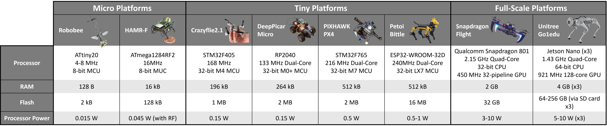
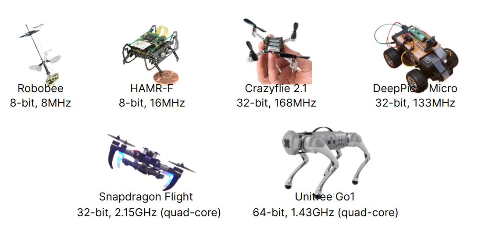
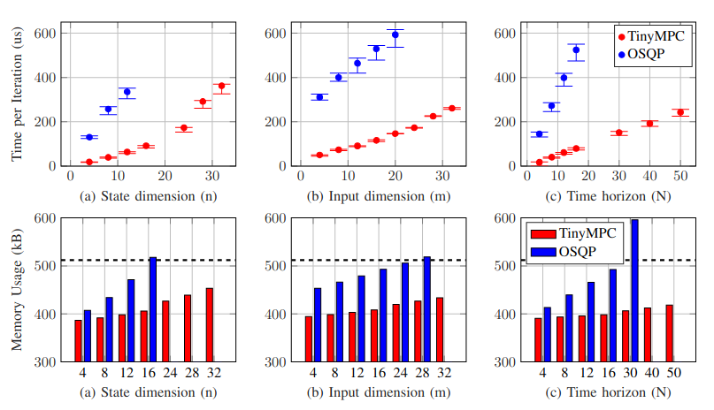
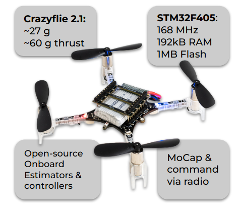

# **TinyMPC: Model-Predictive Control on Resource-Constrained Microcontrollers**

[Anoushka Alavilli* ](https://www.linkedin.com/in/anoushka-alavilli-89586b178/){:target="_blank"},
[Khai Nguyen* ](https://xkhainguyen.github.io/){:target="_blank"}, 
[Sam Schoedel* ](https://samschoedel.com/){:target="_blank"}, 
[Brian Plancher ](https://brianplancher.com/){:target="_blank"}, 
[Zachary Manchester ](https://www.linkedin.com/in/zacmanchester/){:target="_blank"}

**Carnegie Mellon University, Barnard College**

<sup>*Equal contribution and alphabetically ordered</sup>

[Paper](/docs/){:target="_blank"}{: .btn }
[arXiv](https://arxiv.org/abs/2310.16985){:target="_blank"}{: .btn }
[Video](https://www.youtube.com/watch?v=NKOrRyhcr6w){:target="_blank"}{: .btn }
[Summary](/docs/){:target="_blank"}{: .btn }
[Code](https://github.com/tinympc/tinympc){:target="_blank"}{: .btn }

---

<iframe height="400" src="https://www.youtube.com/embed/NKOrRyhcr6w" title="YouTube video player" frameborder="0" style="border: 0px solid #bbb; border-radius: 10px; width: 100%;" allow="accelerometer; autoplay; clipboard-write; encrypted-media; gyroscope; picture-in-picture" allowfullscreen=""></iframe>

---

## Abstract

Model-predictive control (MPC) is a powerful tool for controlling highly dynamic robotic systems subject to complex constraints. However, MPC is computationally demanding, and is often impractical to implement on small, resource-constrained robotic platforms. We present TinyMPC, a high-speed MPC solver with a low memory footprint targeting the microcontrollers common on small robots. Our approach is based on the alternating direction method of multipliers (ADMM) and leverages the structure of the MPC problem for efficiency. We demonstrate TinyMPC both by benchmarking against the state-of-the-art solver OSQP, achieving nearly an order of magnitude speed increase, as well as through hardware experiments on a 27 g quadrotor, demonstrating high-speed trajectory tracking and dynamic obstacle avoidance.

---

## Robot Hardware Comparison





---

## Microcontroller Benchmarks on Teensy ↓



---

## Robot Hardware



---

## Medium-Pace Figure-8 Tracking

<!-- <iframe width="840" height="473" src="../assets/videos/fig81.mp4" title="youtube video player" frameborder="0" allow="accelerometer; autoplay; clipboard-write; encrypted-media; gyroscope; picture-in-picture" allowfullscreen></iframe> -->

<video width="100%" preload="auto" muted autoplay controls loop style="border: 0px solid #bbb; border-radius: 10px; width: 100%;">
    <source src="../assets/videos/fig81.mp4" type="video/mp4">
</video>

---

## Fast-Pace Figure-8 Tracking

<!-- <iframe width="840" height="473" src="../assets/videos/fig82.mp4" title="youtube video player" frameborder="0" allow="accelerometer; autoplay; clipboard-write; encrypted-media; gyroscope; picture-in-picture" allowfullscreen></iframe> -->

<video width="100%" preload="auto" muted autoplay controls loop style="border: 0px solid #bbb; border-radius: 10px; width: 100%;">
    <source src="../assets/videos/fig82.mp4" type="video/mp4">
</video>

---

## Extreme Pose Recovery

<!-- <iframe width="840" height="473" src="../assets/videos/fextreme.mp4" title="youtube video player" frameborder="0" allow="accelerometer; autoplay; clipboard-write; encrypted-media; gyroscope; picture-in-picture" allowfullscreen></iframe> -->

<video width="100%" preload="auto" muted autoplay controls loop style="border: 0px solid #bbb; border-radius: 10px; width: 100%;">
    <source src="../assets/videos/fextreme.mp4" type="video/mp4">
</video>

---

## Dynamic Obstacle Avoidance

<!-- <iframe width="840" height="473" src="../assets/videos/favoid.mp4" title="youtube video player" frameborder="0" allow="accelerometer; autoplay; clipboard-write; encrypted-media; gyroscope; picture-in-picture" allowfullscreen></iframe> -->

<video width="100%" preload="auto" muted autoplay controls loop style="border: 0px solid #bbb; border-radius: 10px; width: 100%;">
    <source src="../assets/videos/favoid.mp4" type="video/mp4">
</video>

---

## BibTeX

```latex
@misc{tinympc,
      title={TinyMPC: Model-Predictive Control on Resource-Constrained Microcontrollers}, 
      author={Anoushka Alavilli and Khai Nguyen and Sam Schoedel and Brian Plancher and Zachary Manchester},
      year={2023},
      eprint={2310.16985},
      archivePrefix={arXiv},
      primaryClass={cs.RO}
}
```
